# Meow — Zalo AI Bot

<div align="center">


**Chatbot AI đa năng cho Zalo — Gemini 2.5 Flash · 50+ Tools · Dashboard quản lý bot/service · Studio hồ sơ**

[Tổng quan](#-tổng-quan) • [Cài đặt](#-cài-đặt) • [Cấu hình](#-cấu-hình) • [Cách hoạt động](#-cách-hoạt-động) • [Modules & Tools](#-modules--tools) • [Web Dashboard](#-web-dashboard) • [API Server](#-api-server) • [Triển khai](#-triển-khai)

</div>

---

## 🎯 Tổng Quan

**Meow** là monorepo Bun Workspaces gồm 2 ứng dụng phối hợp:

| App | Vai trò | Stack chính |
|-----|---------|-------------|
| `apps/bot` | Zalo AI Chatbot | Bun, zca-js, Google Gemini, SQLite/Drizzle, RxJS, Hono |
| `apps/web` | Web Dashboard quản lý | Next.js 16, React 19, TailwindCSS 4, TanStack Query |

Bot nhận tin nhắn từ Zalo qua WebSocket (zca-js), xử lý qua pipeline module → AI → tools, rồi trả lời ngay hoặc stream dần. Web Dashboard gọi REST API của bot để hiển thị dashboard, quản lý cài đặt, logs, memories, lịch sử, tasks và backup.

### Điểm nổi bật

- **AI Gemini 2.5 Flash** — thinking budget 8192 token, multi-turn context tới 300k token, tự động xoay nhiều API key khi rate-limit
- **Streaming thời gian thực** — bot gửi từng đoạn ngay khi Gemini bắt đầu generate
- **Message Buffering (RxJS)** — gom nhiều tin nhắn liên tiếp trong 2.5s thành 1 request AI duy nhất
- **50+ Tools qua 9 modules** — Media, Search, Social, Task, Academic, Entertainment và nhiều hơn
- **Background Agent** — scheduler cron tasks chạy độc lập, dùng Groq (GPT/Kimi) để giảm chi phí Gemini
- **Long-term Memory** — vector embedding (Gemini Embedding 001, 768 chiều) + decay theo thời gian
- **Cloud Backup/Restore** — tự động backup SQLite lên GitHub Gist, tự restore khi deploy lại
- **Web Dashboard mở rộng** — profile studio, command center, bot terminal, QR login manager
- **Settings Auto-save** — nút gạt/tích lưu ngay, ô text/số tự lưu khi Enter hoặc click ra ngoài
- **Command RBAC** — phân quyền lệnh (everyone/admin), bật/tắt từng lệnh, tách riêng khỏi whitelist chat tổng
- **QR Login qua web** — tạo QR mới, xóa session, theo dõi trạng thái bot, nút eye ẩn/hiện QR tránh lộ mã
- **Web Chat tab `/chat`** — giao diện chat cố định ~90% viewport, lưu nhiều session, mở lại màn hình trống và resume session cũ theo nhu cầu
- **Realtime Time & Holiday Context** — bơm mốc thời gian hiện tại (UTC+7) theo từng lượt chat và ngữ cảnh ngày lễ cố định
- **Chat Persona Guard** — ưu tiên xưng hô `em` với `anh/chị`, hạn chế giọng CSKH và giảm style quá đà khi trả lời kỹ thuật
- **Process & Service Guard** — chống start chồng bot, ưu tiên NSSM service, fallback process manager
- **Docker + Cloud-Ready** — health check, base64 credentials, hỗ trợ Railway/Render/Fly.io

---

### 📌 Phiên bản hiện tại

- **Version:** `1.2.0` (README update: `2026-03-06`)
- **Thay đổi chính trong 1.2.0:**
  - Refactor `chat_style` thành module persona đầy đủ: `normal`, `genz_soft`, `genz_bestie`, `genz_hype`, `flirty_light`
  - Thêm style guard cho nội dung kỹ thuật: tự giảm emoji/filler, ưu tiên câu sạch khi có log/code/link/hướng dẫn
  - Chuẩn hóa xưng hô toàn hệ thống chat (web + Zalo): bot xưng `em`, gọi user `anh/chị`
  - Bổ sung test integration cho `chat_style` và `realtimeTimeHoliday` để giữ ổn định backward compatibility
- **Thay đổi chính trong 1.1.1:**
  - Bổ sung trang `/chat` cho web dashboard: chat trực tiếp với bot, session title cố định kiểu `Đoạn chat #N`
  - Session chat web mở trống khi vào lại, chỉ scroll trong khung chat, hỗ trợ resume hội thoại cũ theo danh sách session
  - Hiển thị tên/avatar trong chat web theo hồ sơ Admin/Bot (kèm fallback cache local nếu API settings lỗi tạm thời)
  - Bổ sung `REALTIME TIME CONTEXT` theo từng message để bot trả lời giờ/ngày hiện tại chính xác ngay trong session dài
  - Bổ sung ngữ cảnh ngày lễ cố định; với lễ âm lịch/lễ di động bot sẽ ưu tiên Google Search để trả ngày chính xác theo năm
  - Chuẩn hóa xưng hô trong style chat: bot xưng `em`, gọi user `anh/chị`
- **Thay đổi chính trong 1.1.0:**
  - Bổ sung trang `/zalo-login` quản lý đăng nhập Zalo bằng QR trên web
  - Bổ sung trang `/profile` với 2 hồ sơ riêng (Admin/Bot) và Studio hiệu ứng giao diện
  - Bổ sung command access chi tiết cho non-admin trong settings + dashboard lệnh
  - Chuẩn hóa process/service để giảm lỗi start trùng khi chạy local/service
  - Cập nhật `.gitignore` cho `service-logs` để tránh dirty repo liên tục

### 🆕 Chi tiết tính năng mới (1.2.x)

| Nhóm | Mô tả chi tiết |
|------|----------------|
| **Web Chat Sessions** | Tab `/chat` hoạt động theo cơ chế session độc lập. Mỗi session có tiêu đề cố định kiểu `Đoạn chat #N`, có thể tạo mới, mở lại, xóa riêng từng session. Dữ liệu session lưu local để mở lại nhanh, đồng thời context hội thoại phía bot vẫn tách theo `webchat-<sessionId>`. |
| **Profile-aware chat UI** | Tin nhắn `user` và `bot` trên web lấy display name + avatar từ `settings.profiles.admin` và `settings.profiles.bot`. Nếu API settings tạm lỗi/offline, UI dùng cache local fallback để không mất tên/ảnh ngay. |
| **Realtime Time & Holiday** | Mỗi lượt chat đều được inject `REALTIME TIME CONTEXT` (timezone UTC+7, ngày/giờ hiện tại, upcoming fixed holidays). Nếu user hỏi lễ âm lịch/lễ di động theo năm, prompt sẽ ưu tiên Google Search để tránh trả sai ngày. |
| **Chat Style Engine** | `chat_style` hỗ trợ nhiều persona (`normal`, `genz_soft`, `genz_bestie`, `genz_hype`, `flirty_light`) với style-guard: tự giảm độ “gen Z” khi trả lời kỹ thuật, log/code/link/hướng dẫn dài. |
| **Xưng hô chuẩn** | Cả Zalo và web chat đều ưu tiên bot xưng `em`, gọi user `anh/chị`; hạn chế văn phong CSKH máy móc. |
| **Regression tests** | Bổ sung integration tests cho `chat_style` và `realtimeTimeHoliday` để giữ backward compatibility của normalize, detect language, search intent/filtering và behavior deterministic theo seed. |

---

## 📋 Yêu Cầu

| Thành phần | Phiên bản | Ghi chú |
|-----------|-----------|---------|
| [Bun](https://bun.sh) | 1.0+ | Runtime cho cả bot lẫn build web |
| Tài khoản Zalo | — | Tài khoản riêng cho bot (không dùng tài khoản cá nhân) |
| Gemini API Key | — | [Lấy miễn phí tại AI Studio](https://aistudio.google.com/app/apikey) |

> Các API key khác (Groq, E2B, Freepik, ElevenLabs, YouTube, Google Search, Giphy) là **tuỳ chọn** — thiếu key nào thì tool đó tự vô hiệu hoá.

---

## 🚀 Cài Đặt

```bash
# 1. Clone repo
git clone https://github.com/your-org/meow.git
cd meow

# 2. Cài tất cả dependencies (bot + web)
bun install

# 3. Tạo file môi trường
cp apps/bot/.env.example apps/bot/.env
# Mở apps/bot/.env và điền GEMINI_API_KEY

# 4. Chạy database migrations
bun run --cwd apps/bot db:migrate

# 5. Khởi động bot (lần đầu sẽ tạo qr.png)
bun run dev:bot
```

### Đăng nhập Zalo lần đầu

**Cách A (terminal truyền thống)**
1. Chạy `bun run dev:bot` — file `apps/bot/qr.png` được tạo tự động
2. Mở app Zalo trên điện thoại → **Cài đặt → Liên kết thiết bị → Quét mã QR**
3. Sau khi quét thành công, `credentials.json` được lưu trong `apps/bot/` — các lần chạy sau tự động dùng file này (không cần quét lại)

**Cách B (qua web dashboard)**
1. Chạy web: `bun run dev:web`
2. Mở trang `http://localhost:3000/zalo-login`
3. Bấm **Khởi động bot** hoặc **Tạo QR mới**, sau đó dùng nút **Hiện QR / Ẩn QR** để quét an toàn
4. Có thể **Xóa phiên đăng nhập** trực tiếp từ web nếu cần đăng nhập lại

---

## ⚙️ Cấu Hình

### Biến Môi Trường (`apps/bot/.env`)

```bash
# ── Bắt buộc ──────────────────────────────────────────────
GEMINI_API_KEY=your_gemini_api_key
# Nhiều key (tự xoay khi rate-limit):
# GEMINI_API_KEY=key1,key2,key3
# Hoặc đánh số: GEMINI_API_KEY_1=key1  GEMINI_API_KEY_2=key2

# ── AI phụ trợ ─────────────────────────────────────────────
GROQ_API_KEY=your_groq_key              # Background Agent scheduler

# ── Media & Tools ──────────────────────────────────────────
E2B_API_KEY=your_e2b_key                # Sandbox chạy code
FREEPIK_API_KEY=your_freepik_key        # Tạo ảnh AI
ELEVENLABS_API_KEY=your_elevenlabs_key  # Text-to-Speech
YOUTUBE_API_KEY=your_youtube_key        # Tìm kiếm YouTube
GOOGLE_SEARCH_API_KEY=your_search_key   # Google Custom Search
GOOGLE_SEARCH_CX=your_search_engine_cx
GIPHY_API_KEY=your_giphy_key            # Tìm kiếm GIF

# ── Cloud Backup ───────────────────────────────────────────
GITHUB_GIST_TOKEN=your_github_pat       # Personal Access Token (gist scope)
GITHUB_GIST_ID=your_gist_id             # ID gist đã tạo sẵn

# ── Dashboard Security ─────────────────────────────────────
API_KEY=your_random_secret              # Bearer token bảo vệ REST API
PORT=10000                              # Port bot API server (default 10000)
```

Web Dashboard (`apps/web`) cần thêm file `apps/web/.env.local`:

```bash
BOT_API_URL=http://localhost:10000/api   # URL bot API (server-side)
BOT_API_KEY=your_random_secret           # Phải khớp với API_KEY của bot

# Tùy chọn cho process manager trên web
BOT_DIR=../bot                           # đường dẫn bot từ apps/web
BOT_PORT=10000                           # dùng để kiểm tra health/start
```

### Cài đặt Runtime (`apps/bot/settings.json`)

File này được đọc khi khởi động và **reload nóng** qua Dashboard mà không cần restart bot. Các section quan trọng:

| Section | Key quan trọng | Mô tả |
|---------|---------------|-------|
| `bot.name` | `"Trợ lý AI Zalo"` | Tên bot |
| `bot.prefix` | `"#bot"` | Prefix kích hoạt |
| `bot.requirePrefix` | `false` | Bắt buộc prefix hay không |
| `bot.useStreaming` | `true` | Streaming response |
| `bot.useCharacter` | `true` | System prompt nhân vật |
| `bot.maxToolDepth` | `10` | Tối đa vòng lặp tool calls |
| `bot.maxTokenHistory` | `300000` | Token context tối đa giữ trong memory |
| `bot.allowNSFW` | `false` | Cho phép nội dung 18+ |
| `bot.sleepMode` | `{enabled, sleepHour, wakeHour}` | Tự động offline theo giờ |
| `bot.maintenanceMode` | `{enabled, message}` | Chế độ bảo trì |
| `bot.cloudDebug` | `{enabled, prefix}` | Nhận lệnh debug qua Zalo |
| `buffer.delayMs` | `2500` | Cửa sổ gom tin nhắn (ms) |
| `modules.*` | `true/false` | Bật/tắt từng module |
| `allowedUserIds` | `[]` | Whitelist user (rỗng = tất cả) |
| `allowedGroupIds` | `[]` | Whitelist nhóm (rỗng = tất cả) |
| `allowAllGroups` | `true` | Bật/tắt cho phép tất cả nhóm |
| `autoReplyGroupIds` | `[]` | Nhóm tự reply không cần @mention |
| `adminUserId` | `""` | User ID admin (quyền đặc biệt) |
| `commandAccess.commandsEnabled` | `true` | Bật/tắt toàn bộ hệ thống lệnh `!` |
| `commandAccess.respectGlobalAccessLists` | `false` | Có áp whitelist chat tổng cho command hay không |
| `commandAccess.commandRoles` | `{}` | Phân quyền từng lệnh (`everyone` / `admin`) |
| `commandAccess.disabledCommands` | `[]` | Danh sách lệnh bị vô hiệu hóa |
| `profiles.admin` / `profiles.bot` | `{displayName, pronouns, bio, avatarUrl, coverUrl}` | Hồ sơ hiển thị trên dashboard |
| `gemini.models` | `[...]` | Danh sách model, tự fallback nếu lỗi |
| `gemini.thinkingBudget` | `8192` | Token thinking Gemini |
| `groqModels.primary` | `"openai/gpt-oss-120b"` | Model Groq chính |
| `backgroundAgent.pollIntervalMs` | `90000` | Interval poll tasks (ms) |
| `cloudBackup.enabled` | `true` | Bật auto cloud backup |
| `memory.decayHalfLifeDays` | `30` | Tốc độ quên memory (ngày) |
| `messageChunker.maxMessageLength` | `1800` | Ký tự tối đa 1 tin nhắn |

---

## 💡 Cách Hoạt Động

### 1. Khởi Động Bot (`main.ts`)

```
main.ts
 ├─ startApiServer()          → Hono HTTP server port 10000
 ├─ initAutoBackup()          → Restore từ GitHub Gist nếu DB không tồn tại
 ├─ initLogging()             → Setup pino logger + file logging (nếu bật)
 ├─ loginZalo()               → Đăng nhập bằng credentials.json hoặc QR
 ├─ initializeApp()           → Đăng ký 9 modules, khởi tạo services
 ├─ setupListeners(api)       → WebSocket listener + preload lịch sử DB
 ├─ registerMessageListener() → Gắn handler xử lý tin nhắn Zalo
 └─ startBackgroundAgent()    → Khởi động cron scheduler
```

### 2. Pipeline Xử Lý Tin Nhắn

```
Zalo WebSocket ──► message event
                       │
               message.listener.ts
                   ├─ Emit EVENT: MESSAGE_RECEIVED (EventBus)
                   ├─ Kiểm tra lệnh #onbot / #unbot (tự gửi trong nhóm)
                   ├─ shouldSkipMessage()  → rate-limit, sleep mode, maintenance
                   ├─ isAllowedUser()      → kiểm tra whitelist user/group
                   ├─ isBotMentioned()     → kiểm tra prefix / @mention
                   └─ addToBuffer()        → đẩy vào RxJS Subject
                              │
                    RxJS debounceTime(2500ms)
                              │ (sau 2.5s không có tin mới)
                   message.buffer.ts ── gom [n tin nhắn] → 1 batch
                              │
                   gateway.module.ts
                       ├─ Nạp context lịch sử từ DB (history.repository)
                       ├─ Normalize slang + build chat-style hint (persona guard)
                       ├─ Inject REALTIME TIME CONTEXT (UTC+7 + holiday hints)
                       ├─ Download + xử lý media đính kèm:
                       │      ├─ Ảnh  → upload inline data → Gemini
                       │      ├─ Audio/Voice → transcribe tự động
                       │      ├─ Video → trích xuất thumbnail
                       │      └─ File (PDF/DOCX/PPTX/XLSX) → trích xuất text
                       ├─ Inject long-term memories liên quan
                       └─ GeminiProvider.generateStream()
                              │ [streaming chunks]
                   response.handler.ts
                       ├─ Parse response tags: [reaction], [sticker], [msg], [quote], [undo]
                       ├─ Parse Zalo markdown: *bold*, _italic_, __underline__, ~strike~
                       ├─ Render `mermaid` code block → PNG
                       ├─ Chia nhỏ nếu > 1800 ký tự
                       └─ Gửi qua zca-js (sendMessage / sendImage / sendFile…)
```

### 3. Tool Calling (Function Calling)

Khi Gemini quyết định gọi tool, `ToolRegistry` dispatch đến module tương ứng → thực thi → trả kết quả về Gemini để tiếp tục. Vòng lặp tối đa `maxToolDepth` lần (default 10).

```
Gemini → functionCall: { name: "googleSearch", args: {query: "..."} }
           │
    ToolRegistry.execute("googleSearch", args, context)
           │
    SearchModule.googleSearchTool.execute(args, context)
           │  → Gọi Google Custom Search API
           │
    Gemini nhận tool result → tiếp tục generate phản hồi cho user
```

### 4. Background Agent (Cron Scheduler)

Agent thứ hai chạy song song, poll database mỗi 90s tìm task đến hạn:

```
startBackgroundAgent()
    │
    ▼  mỗi 90 giây
agent.runner.ts
    ├─ getPendingTasks()        → lấy tasks cron từ bảng agent_tasks
    ├─ matchesCron(expr, now)   → kiểm tra task nào đủ điều kiện chạy
    └─ executeTask(task)
           ├─ buildEnvironmentContext()  → thông tin nhóm/user/thời gian
           ├─ Gọi Groq (GPT-OSS-120B / Kimi-K2) với tool list
           │    → tiết kiệm chi phí so với Gemini cho tasks định kỳ
           └─ Gửi kết quả về threadId của task
```

### 5. Long-term Memory

```
saveMemory tool
    │
MemoryRepository
    ├─ Tạo embedding vector (Gemini Embedding 001, 768 chiều)
    ├─ Lưu vào bảng memories (SQLite)
    └─ Ghi importanceScore + lastAccessedAt

recallMemory tool
    ├─ Embed query → cosine similarity search trong SQLite
    ├─ Áp dụng decay: score × exp(−λt)  với t = ngày kể từ lần cuối access
    └─ Trả top-k memories liên quan nhất cho Gemini
```

### 6. Cloud Backup / Restore

```
Bot khởi động
    │
    ├─ data/bot.db KHÔNG tồn tại?
    │      └─ Tải về từ GitHub Gist → giải nén → khôi phục DB
    │
    └─ DB đã có → đặt lịch backup định kỳ
           └─ Mỗi khi có thay đổi lớn (throttle 2 phút):
                  nén DB → upload lên GitHub Gist
```

### 7. Lệnh Điều Khiển Bot Qua Zalo

Các lệnh bot tự gửi trong nhóm:

| Lệnh | Mô tả |
|------|-------|
| `#onbot` | Bật chế độ auto-reply cho nhóm (không cần @mention) |
| `#unbot` | Tắt chế độ auto-reply |

### 8. Luồng Chat Web Session (`/chat`)

```
apps/web/chat/page.tsx
    ├─ Mở trang ở trạng thái trống (không auto-open session cũ)
    ├─ Tạo session mới theo tiêu đề: "Đoạn chat #N"
    ├─ Lưu danh sách session/messages vào localStorage
    ├─ Chọn session bất kỳ để resume hội thoại
    └─ Gửi message → POST /api/web-chat → proxy /api/web-chat (bot)
                                  │
                                  └─ bot chat.api.ts dùng threadId: webchat-<sessionId>
                                      để giữ context riêng từng session
```

---

## 🔌 Modules & Tools

### Gateway Module *(core — luôn bật)*

Xử lý toàn bộ pipeline tin nhắn: buffer, classifier, guard, history, media, AI call, response handler. Không expose tools cho AI — đây là lớp infrastructure.

---

### System Module

| Tool | Mô tả |
|------|-------|
| `sleepMode` | Bật/tắt sleep mode ngay lập tức |
| `maintenanceMode` | Bật/tắt chế độ bảo trì |
| `reloadSettings` | Reload settings.json không cần restart |
| `flushLogs` | Đóng gói và gửi file log qua Zalo |

---

### Chat Module

| Tool | Mô tả |
|------|-------|
| `clearHistory` | Xóa lịch sử hội thoại của thread hiện tại |
| `saveMemory` | Lưu thông tin vào long-term memory (kèm embedding) |
| `recallMemory` | Tìm kiếm ngữ nghĩa trong long-term memory |

---

### Media Module

| Tool | Yêu cầu API | Mô tả |
|------|-------------|-------|
| `createChart` | — | Tạo biểu đồ (bar, line, pie, doughnut…) bằng Chart.js, xuất PNG |
| `createFile` | — | Tạo tài liệu `.docx`, `.pdf`, `.pptx`, `.xlsx`, gửi thẳng về Zalo |
| `freepikImage` | Freepik | Tạo ảnh AI từ text prompt, poll đến khi hoàn thành |
| `textToSpeech` | ElevenLabs | Chuyển văn bản thành file `.mp3` giọng nói tự nhiên |

---

### Search Module

| Tool | Yêu cầu API | Mô tả |
|------|-------------|-------|
| `googleSearch` | Google Search | Tìm kiếm web, trả về snippets + URL |
| `youtube` | YouTube Data API | Tìm kiếm video, lấy thông tin, transcript |
| `weather` | — | Thời tiết hiện tại theo thành phố (wttr.in) |
| `currency` | — | Tỷ giá hối đoái thời gian thực |
| `steam` | — | Thông tin game, giá, review trên Steam |

---

### Social Module

| Tool | Mô tả |
|------|-------|
| `getUserInfo` | Lấy thông tin profile user Zalo |
| `getAllFriends` | Danh sách bạn bè hiện tại |
| `getFriendOnlines` | Danh sách bạn đang online |
| `getGroupMembers` | Lấy thành viên của một nhóm |
| `forwardMessage` | Chuyển tiếp tin nhắn đến thread khác |
| `board` | Quản lý bảng ghi chú trong nhóm |
| `poll` | Tạo và quản lý bình chọn trong nhóm |
| `reminder` | Tạo, sửa, xóa nhắc nhở tích hợp Zalo |
| `groupAdmin` | Quản lý nhóm: kick, thêm admin, đổi tên, ảnh đại diện |
| `friendRequest` | Gửi/chấp nhận/hủy lời mời kết bạn |

---

### Task Module

| Tool | Yêu cầu API | Mô tả |
|------|-------------|-------|
| `executeCode` | E2B | Chạy code Python/JS trong sandbox cloud cô lập |
| `solveMath` | — | Giải toán, render công thức LaTeX thành ảnh PNG |
| `createApp` | — | Tạo project code nhỏ, đóng gói file zip |
| `scheduleTask` | Groq | Tạo cron task định kỳ, lưu vào DB |

---

### Academic Module *(TVU Portal)*

| Tool | Mô tả |
|------|-------|
| `tvuLogin` | Đăng nhập portal trường TVU |
| `tvuStudentInfo` | Thông tin sinh viên |
| `tvuSemesters` | Danh sách học kỳ |
| `tvuSchedule` | Thời khóa biểu |
| `tvuGrades` | Kết quả học tập |
| `tvuTuition` | Thông tin học phí |
| `tvuCurriculum` | Chương trình đào tạo |
| `tvuNotifications` | Thông báo từ portal |

---

### Entertainment Module

| Tool | Yêu cầu API | Mô tả |
|------|-------------|-------|
| `jikanSearch` | — | Tìm kiếm anime / manga (Jikan API) |
| `jikanDetails` | — | Chi tiết anime/manga/nhân vật |
| `jikanTop` | — | Bảng xếp hạng (top anime, manga…) |
| `jikanSeason` | — | Anime theo mùa phát sóng |
| `jikanCharacters` | — | Danh sách nhân vật của một series |
| `jikanRecommendations` | — | Gợi ý dựa trên anime đã xem |
| `jikanGenres` | — | Danh sách thể loại |
| `jikanEpisodes` | — | Danh sách tập |
| `nekosImages` | — | Ảnh anime ngẫu nhiên theo category |
| `giphyGif` | Giphy | Tìm và gửi GIF |

---

### Response Tags

Bot tự parse các tag đặc biệt trong output của Gemini:

```
[reaction:heart]           → Thả reaction tim vào tin nhắn cuối của user
[reaction:like]            → Thả reaction like
[sticker:hello]            → Gửi sticker (tìm theo keyword)
[msg]Nội dung[/msg]        → Gửi tin nhắn riêng biệt
[quote:0]Trả lời[/quote]   → Reply vào tin nhắn thứ N trong buffer
[undo:-1]                  → Thu hồi tin nhắn cuối của bot (trong vòng 2 phút)
```

### Zalo Markdown

| Cú pháp | Kết quả |
|---------|---------|
| `*text*` | **Đậm** |
| `_text_` | *Nghiêng* |
| `__text__` | Gạch chân |
| `~text~` | ~~Gạch ngang~~ |
| ` ```mermaid ... ``` ` | Render diagram thành ảnh PNG rồi gửi |

---

## 📥 Xử Lý Media Đến

| Loại | Định dạng | Bot làm gì |
|------|-----------|-----------|
| Hình ảnh | PNG, JPG, WEBP, GIF, HEIC | Upload inline vào Gemini để phân tích |
| Video | MP4, MOV, AVI, WEBM (< 20MB) | Trích xuất thumbnail, đính kèm context |
| Audio / Voice | AAC, MP3, WAV, OGG, FLAC | Transcribe tự động → thêm vào context |
| Tin nhắn thoại Zalo | Định dạng Zalo native | Transcribe tự động → thêm vào context |
| PDF | `.pdf` | Trích xuất text |
| Word | `.docx` | Trích xuất text (mammoth) |
| PowerPoint | `.pptx` | Trích xuất text (officeparser) |
| Excel | `.xlsx` | Trích xuất dữ liệu (exceljs) |
| Code / Text | `.js .ts .py .java .md…` | Đọc nội dung thẳng |

---

## 🌐 Web Dashboard

Dashboard Next.js 16 (App Router) chạy tại port 3000, giao tiếp với bot qua REST API Bearer Auth.

### Ảnh giao diện (Screenshots)

<details>
  <summary>Bấm để xem toàn bộ ảnh giao diện dashboard</summary>

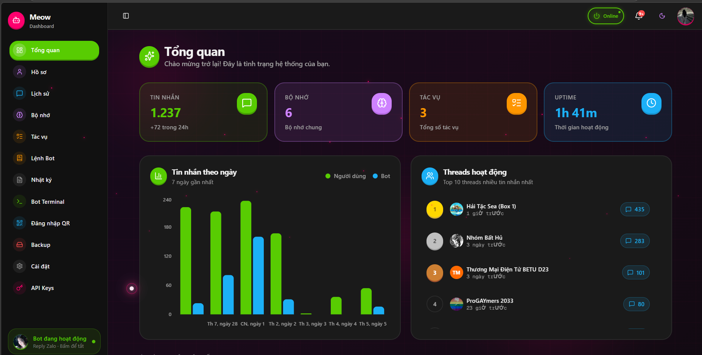
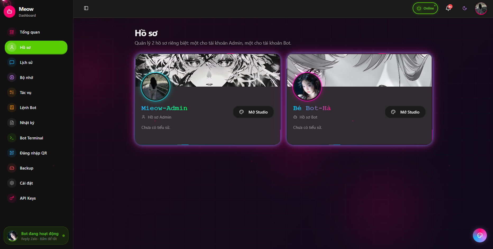
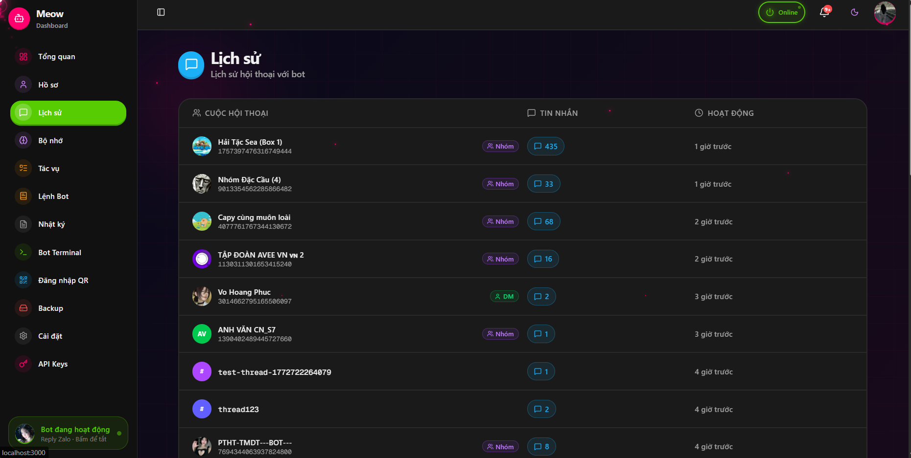
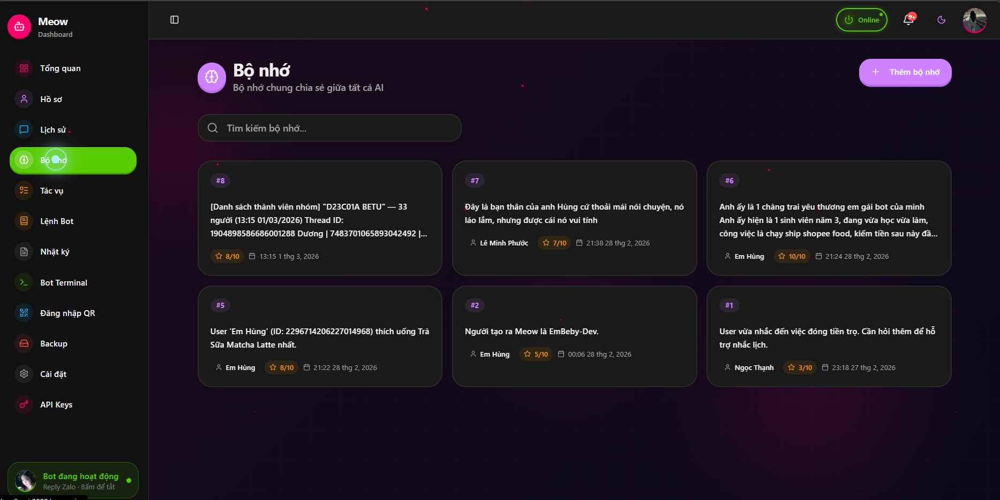
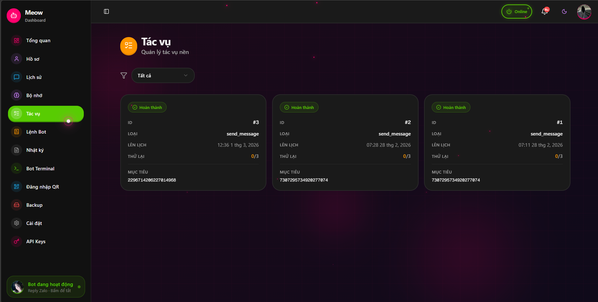
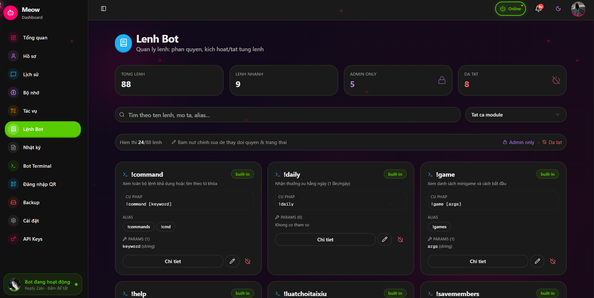
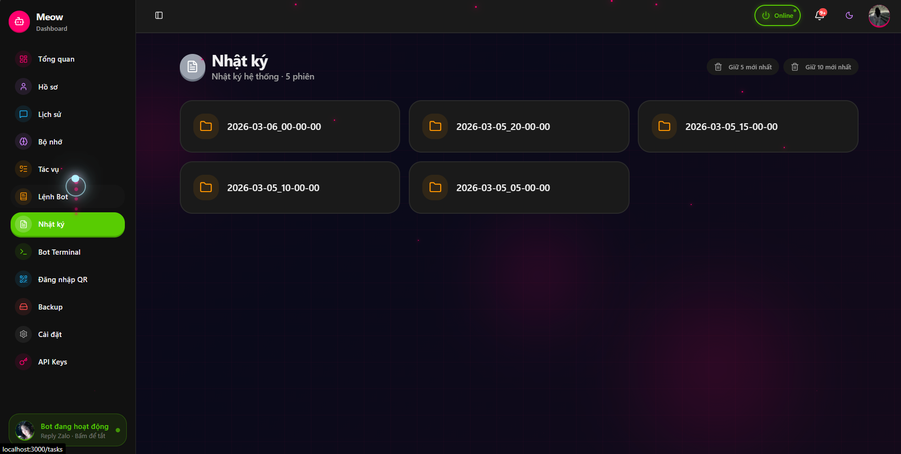
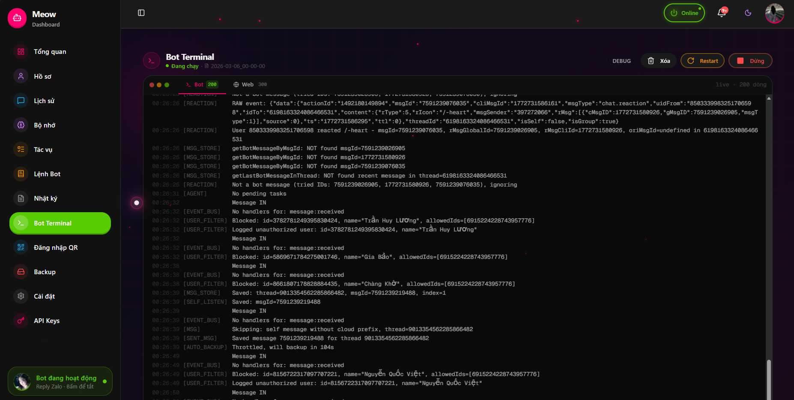
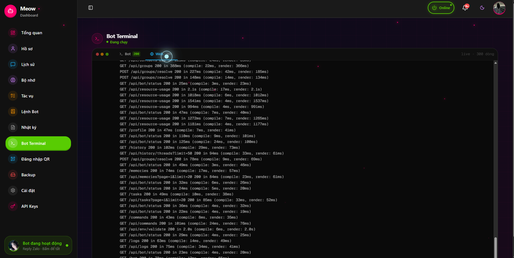
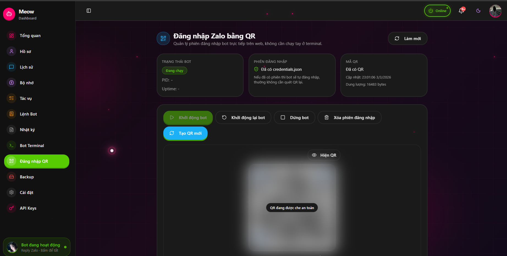
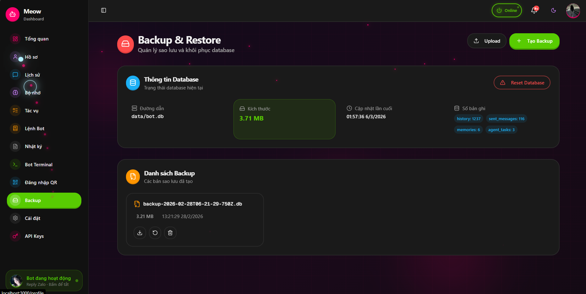
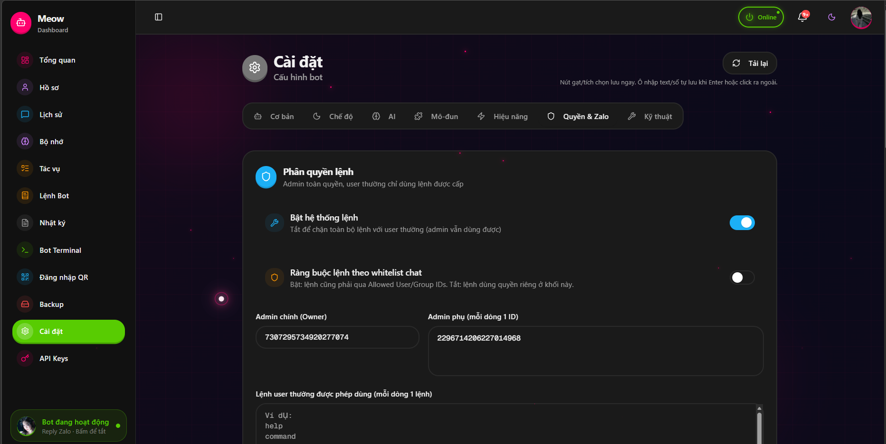
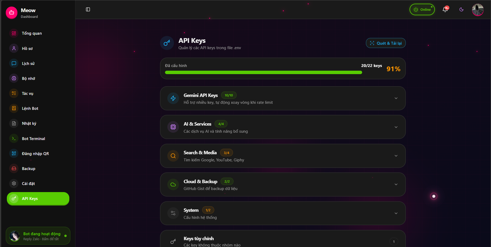

</details>

### Các trang

| Route | Nội dung |
|-------|---------|
| `/` | Tổng quan: active threads, thống kê tin nhắn, trạng thái bot |
| `/chat` | Chat trực tiếp với bot: giao diện cố định ~90% viewport, session lưu local và mở lại theo nhu cầu |
| `/settings` | Chỉnh sửa toàn bộ `settings.json` (auto-save), reload không restart |
| `/profile` | Quản lý 2 hồ sơ Admin/Bot + Studio viền/avatar/chữ/cover |
| `/commands` | Danh mục lệnh bot, phân quyền admin/everyone, bật/tắt từng lệnh |
| `/bot` | Bot terminal trên web: start/stop/restart, xem log runtime |
| `/zalo-login` | Đăng nhập Zalo qua QR: tạo QR mới, xóa session, ẩn/hiện QR |
| `/logs` | Xem logs, lọc theo level, tìm kiếm full-text |
| `/memories` | CRUD long-term memories: tạo, chỉnh sửa, xóa |
| `/history` | Lịch sử hội thoại theo thread với tên và avatar |
| `/tasks` | Quản lý background cron tasks: tạo, dừng, chạy thủ công |
| `/backup` | Trạng thái backup, kích hoạt backup/restore thủ công |
| `/env-keys` | Xem và cập nhật biến môi trường `.env` của bot |

### Giải quyết tên thread (Groups & Contacts)

Dashboard tự động dịch thread ID thành tên/avatar qua 3 lớp:

1. **Groups cache** — `GET /api/groups` (bot cache 10 phút)
2. **Contacts cache** — `GET /api/contacts` (bot cache 10 phút)
3. **On-demand resolve** — `POST /api/groups/resolve` với danh sách ID chưa biết → bot thử `getGroupInfo` rồi `getUserInfo` từ Zalo API

### Chạy Dashboard

```bash
# Development
bun run dev:web

# Production build
bun run build:web
bun run --cwd apps/web start
```

### API nội bộ của web (Next.js API Routes)

| Method | Path | Mô tả |
|--------|------|-------|
| `GET/POST` | `/api/bot-process` | Start/stop/restart bot, chống start chồng |
| `GET` | `/api/bot-process/logs` | Đọc log runtime bot manager |
| `GET` | `/api/zalo-auth/status` | Trạng thái credentials/QR |
| `GET` | `/api/zalo-auth/qr` | Trả ảnh `qr.png` |
| `DELETE` | `/api/zalo-auth/session` | Xóa `credentials.json`, `credentials.base64.txt`, `qr.png` |
| `POST` | `/api/web-chat` | Gửi tin nhắn chat web theo session (`message`, `sessionId`) |
| `DELETE` | `/api/web-chat/:sessionId` | Xóa context một session chat web |
| `ALL` | `/api/[...path]` | Proxy sang Bot API, giữ `BOT_API_KEY` ở server-side |

---

## 🔌 API Server (Bot)

Bot tự chạy Hono HTTP server tại `http://localhost:10000`. Tất cả endpoints đặt dưới `/api/` và bảo vệ bằng Bearer token (`API_KEY` trong `.env`).

| Method | Path | Mô tả |
|--------|------|-------|
| `GET` | `/health` | Health check, trả uptime |
| `GET` | `/api/settings` | Đọc settings hiện tại |
| `PUT` | `/api/settings` | Cập nhật + reload settings ngay |
| `GET` | `/api/stats` | Thống kê hệ thống |
| `GET` | `/api/stats/active-threads` | Top threads hoạt động nhiều nhất |
| `GET` | `/api/history` | Lịch sử hội thoại (filter theo threadId) |
| `GET` | `/api/logs` | Xem log entries |
| `GET` | `/api/memories` | Danh sách memories |
| `POST` | `/api/memories` | Tạo memory mới |
| `PUT` | `/api/memories/:id` | Cập nhật memory |
| `DELETE` | `/api/memories/:id` | Xóa memory |
| `GET` | `/api/tasks` | Danh sách background tasks |
| `POST` | `/api/tasks` | Tạo task mới |
| `DELETE` | `/api/tasks/:id` | Hủy task |
| `POST` | `/api/tasks/:id/run` | Chạy task ngay lập tức |
| `GET` | `/api/backup/status` | Trạng thái backup |
| `POST` | `/api/backup/trigger` | Kích hoạt backup thủ công |
| `POST` | `/api/backup/restore` | Restore từ GitHub Gist |
| `GET` | `/api/groups` | Danh sách nhóm Zalo (cache 10 phút) |
| `POST` | `/api/groups/refresh` | Làm mới cache groups |
| `POST` | `/api/groups/resolve` | Resolve IDs chưa biết → tên/avatar |
| `GET` | `/api/contacts` | Danh sách bạn bè (cache 10 phút) |
| `POST` | `/api/contacts/refresh` | Làm mới cache contacts |
| `GET` | `/api/env` | Xem danh sách env keys (giá trị bị ẩn) |
| `PUT` | `/api/env` | Cập nhật biến môi trường trong `.env` |
| `GET` | `/api/commands` | Danh mục lệnh, filter/search theo module |
| `GET` | `/api/commands/:name` | Chi tiết một lệnh |
| `PATCH` | `/api/commands/:name/role` | Set role lệnh (`everyone` / `admin`) |
| `PATCH` | `/api/commands/:name/toggle` | Enable/disable một lệnh |
| `POST` | `/api/web-chat` | Chat với bot qua session web (context tách theo `webchat-<sessionId>`) |
| `DELETE` | `/api/web-chat/:sessionId` | Xóa session chat web phía bot |

---

## 🗄️ Database Schema

SQLite tại `apps/bot/data/bot.db`, quản lý bằng Drizzle ORM.

| Bảng | Mô tả | Cột chính |
|------|-------|-----------|
| `history` | Lịch sử hội thoại | `thread_id, role, content, timestamp` |
| `sent_messages` | Log tin nhắn bot đã gửi (dùng cho undo) | `msg_id, thread_id, content, sent_at` |
| `memories` | Long-term memory + embedding | `id, content, embedding (blob), importance_score, last_accessed_at` |
| `agent_tasks` | Hàng đợi background cron tasks | `id, thread_id, cron_expr, prompt, status, last_run_at` |

Migrations nằm trong `apps/bot/drizzle/`.

---

## 🏗️ Kiến Trúc Code

```
meow/
├── apps/
│   ├── bot/
│   │   ├── src/
│   │   │   ├── app/                    # Entry point
│   │   │   │   ├── main.ts             # Bootstrapper chính
│   │   │   │   ├── app.module.ts       # Đăng ký 9 modules
│   │   │   │   └── botSetup.ts         # Login Zalo, logging, listeners
│   │   │   │
│   │   │   ├── core/                   # Framework nội bộ
│   │   │   │   ├── config/             # config.ts + config.schema.ts (Zod)
│   │   │   │   ├── container/          # ServiceContainer (DI)
│   │   │   │   ├── event-bus/          # EventBus pub/sub
│   │   │   │   ├── logger/             # Pino logger + transports + file rotation
│   │   │   │   ├── plugin-manager/     # ModuleManager lifecycle
│   │   │   │   └── tool-registry/      # Parse + dispatch tool calls từ AI
│   │   │   │
│   │   │   ├── infrastructure/         # Adapters bên ngoài
│   │   │   │   ├── ai/                 # GeminiProvider (streaming, key rotation)
│   │   │   │   ├── api/                # Hono REST API Server (settings/stats/tasks/.../zalo-auth/web-chat)
│   │   │   │   ├── backup/             # GitHub Gist backup/restore
│   │   │   │   ├── database/           # SQLite + Drizzle (connection, repos)
│   │   │   │   ├── memory/             # VectorMemory (embedding + decay)
│   │   │   │   └── messaging/          # zca-js wrapper (ZaloService)
│   │   │   │
│   │   │   ├── modules/                # 9 feature modules
│   │   │   │   ├── gateway/            # Pipeline xử lý tin nhắn (core)
│   │   │   │   ├── system/             # System tools
│   │   │   │   ├── chat/               # Memory tools
│   │   │   │   ├── media/              # Chart, File, Image AI, TTS
│   │   │   │   ├── search/             # Google, YouTube, Weather, Currency, Steam
│   │   │   │   ├── social/             # Zalo social tools
│   │   │   │   ├── task/               # Code sandbox, math, app builder, scheduler
│   │   │   │   ├── academic/           # TVU portal
│   │   │   │   ├── entertainment/      # Anime (Jikan), GIF (Giphy), Nekos
│   │   │   │   └── background-agent/   # Cron scheduler (Groq)
│   │   │   │
│   │   │   ├── libs/                   # Builders nội bộ
│   │   │   │   ├── docx-builder/       # Tạo file Word (.docx)
│   │   │   │   └── pptx-builder/       # Tạo file PowerPoint (.pptx)
│   │   │   │
│   │   │   └── shared/                 # Dùng chung
│   │   │       ├── schemas/            # Zod schemas
│   │   │       ├── types/              # TypeScript types
│   │   │       └── utils/              # history, messageStore, taskManager, chat_style, realtimeTimeHoliday
│   │   │                                   ├── chat_style.ts (normalize + language + search + persona style)
│   │   │                                   └── realtimeTimeHoliday.ts (thời gian thực + ngày lễ UTC+7)
│   │   │
│   │   ├── tests/
│   │   │   ├── integration/            # Integration tests theo module + utils (chat_style/realtimeTimeHoliday)
│   │   │   └── e2e/                    # End-to-end bot tests
│   │   ├── drizzle/                    # SQL migration files
│   │   └── settings.json              # Runtime config
│   │
│   └── web/
│       └── src/
│           ├── app/                    # Next.js App Router
│           │   ├── page.tsx            # Dashboard tổng quan
│           │   ├── chat/               # Chat trực tiếp với bot + session manager
│           │   ├── settings/           # Trang cài đặt (auto-save)
│           │   ├── profile/            # Hồ sơ Admin/Bot + style studio
│           │   ├── logs/               # Trang logs
│           │   ├── memories/           # CRUD memories
│           │   ├── history/            # Lịch sử hội thoại
│           │   ├── tasks/              # Background tasks
│           │   ├── commands/           # Dashboard lệnh + RBAC
│           │   ├── bot/                # Bot terminal trên web
│           │   ├── zalo-login/         # Quản lý đăng nhập QR
│           │   ├── backup/             # Cloud backup
│           │   ├── env-keys/           # Env variables
│           │   └── api/                # Proxy + process manager + zalo auth routes
│           │                                ├── [...path] (proxy bot API)
│           │                                ├── bot-process (start/stop/restart guard)
│           │                                └── zalo-auth (status/qr/session)
│           ├── components/
│           │   ├── dashboard/          # Widgets: ActiveThreads, Stats
│           │   ├── layout/             # Sidebar, Header
│           │   └── ui/                 # Radix UI + shadcn components
│           ├── hooks/                  # Custom React hooks
│           └── lib/
│               ├── api.ts              # Typed API clients (tất cả endpoints)
│               └── utils.ts            # formatRelativeTime, formatNumber…
│
├── package.json                        # Monorepo scripts (Bun Workspaces)
└── bun.lock
```

### Core Components

| Component | File | Vai trò |
|-----------|------|---------|
| `EventBus` | `core/event-bus/` | Pub/sub nội bộ — modules giao tiếp không phụ thuộc nhau |
| `ServiceContainer` | `core/container/` | DI container — inject services vào modules |
| `ModuleManager` | `core/plugin-manager/` | Đăng ký, load, unload modules theo lifecycle |
| `ToolRegistry` | `core/tool-registry/` | Parse function call trong AI response → dispatch đúng module |
| `BaseModule` | `core/base/base-module.ts` | Abstract base: `onLoad()`, `onUnload()`, `registerTool()` |
| `BaseTool` | `core/base/base.tool.ts` | Abstract base: `execute()`, Zod schema validate args |
| `GeminiProvider` | `infrastructure/ai/` | Streaming, key rotation, retry, thinking budget |
| `ZaloService` | `infrastructure/messaging/` | Wrapper zca-js: send/receive, upload media, reactions |
| `DatabaseService` | `infrastructure/database/` | SQLite init, migration, health check |
| `VectorMemory` | `infrastructure/memory/` | Embedding + cosine similarity + decay scoring |

---

## 🛠️ Tech Stack

### Bot (`apps/bot`)

| Danh mục | Công nghệ | Ghi chú |
|----------|-----------|---------|
| Runtime | Bun 1.0+ | Hot reload: `bun --watch` |
| Ngôn ngữ | TypeScript 5.7 | Strict mode, ESM |
| AI chính | Google Gemini 2.5 Flash | `@google/genai`, streaming, function calling |
| AI phụ | Groq (GPT-OSS 120B / Kimi-K2) | Background agent — nhanh, rẻ |
| Messaging | zca-js | Unofficial Zalo client |
| Database | SQLite + Drizzle ORM | File local `data/bot.db` |
| Reactive | RxJS 7 | Message buffering với debounce |
| HTTP Server | Hono 4 | Lightweight, Bearer auth middleware |
| HTTP Client | Ky | Fetch wrapper với retry, timeout |
| Validation | Zod | Config schema + tool args |
| Logging | Pino + pino-roll | Structured JSON, rotation theo số dòng |
| Code Sandbox | E2B Code Interpreter | Cloud sandbox Python/JS |
| TTS | ElevenLabs SDK | Model `eleven_v3` |
| Image AI | Freepik Mystic | Async poll API |
| Charts | chart.js + chartjs-node-canvas | Server-side PNG render |
| Documents | docx, pdfkit, pptxgenjs, exceljs | Tạo file Office/PDF |
| Math | KaTeX | Render LaTeX → SVG/PNG |
| Linting | Biome | Format + lint trong một lệnh |

### Web (`apps/web`)

| Danh mục | Công nghệ |
|----------|-----------|
| Framework | Next.js 16 (App Router) |
| UI | React 19, TailwindCSS 4 |
| Components | Radix UI, shadcn/ui, Lucide Icons |
| Data Fetching | TanStack Query v5 |
| Charts | Recharts |
| Forms | React Hook Form + Zod |

---

## 📦 Lệnh Phát Triển

```bash
# ── Development ───────────────────────────────────────────
bun run dev:bot              # Bot với hot reload (bun --watch)
bun run dev:web              # Web dashboard Next.js dev server
run.cmd                      # Windows: start lại bot + web, tránh start chồng

# ── Production ────────────────────────────────────────────
bun run start:bot            # Chạy bot production
bun run build:web            # Build Next.js static

# ── Database ──────────────────────────────────────────────
bun run --cwd apps/bot db:migrate    # Chạy migrations
bun run --cwd apps/bot db:generate   # Tạo migration từ thay đổi schema
bun run --cwd apps/bot db:studio     # Mở Drizzle Studio (GUI trình duyệt)

# ── Testing ───────────────────────────────────────────────
bun run test                         # Unit tests
bun run test:integration             # Tất cả integration tests
bun run --cwd apps/bot test:ai       # Test AI provider
bun run --cwd apps/bot test:database # Test database layer
bun run --cwd apps/bot test:academic # Test TVU portal scraping
bun run --cwd apps/bot test:agent    # Test background agent
bun run --cwd apps/bot test:e2e      # End-to-end tests

# ── Code Quality ──────────────────────────────────────────
bun run lint:bot             # Biome check bot
bun run lint:web             # ESLint check web
bun run format               # Biome format + fix bot
```

### Windows Services (NSSM)

```bat
service-install.cmd          # Cài MeowBot + MeowWeb thành Windows Service
service-uninstall.cmd        # Gỡ dịch vụ
```

---

## 🐳 Triển Khai

### Docker

```bash
docker build -t meow-bot -f apps/bot/Dockerfile .
docker run -d \
  --name meow-bot \
  --env-file apps/bot/.env \
  -p 10000:10000 \
  meow-bot
```

### Docker Compose

```bash
cd apps/bot
docker-compose up -d
```

### Cloud (Railway / Render / Fly.io)

**1. Encode Zalo credentials** sang base64:

```bash
# Linux/Mac
base64 -w 0 apps/bot/credentials.json

# Windows PowerShell
[Convert]::ToBase64String([IO.File]::ReadAllBytes("apps\bot\credentials.json"))
```

**2. Set biến môi trường** trên platform:

```
GEMINI_API_KEY=...
API_KEY=...
ZALO_CREDENTIALS_BASE64=<chuỗi base64>
GITHUB_GIST_TOKEN=...
GITHUB_GIST_ID=...
PORT=10000
```

**3.** Health check endpoint: `GET /health` → `{"status":"ok","uptime":"Xs"}`

**4.** Cloud backup tự động — nếu database không tồn tại khi deploy, bot tự restore từ GitHub Gist trước khi phục vụ.

> **Quan trọng với Railway/Render:** File system ephemeral → luôn bật `cloudBackup.enabled = true` để không mất dữ liệu mỗi lần redeploy.

---

## 🔒 Bảo Mật

- Tất cả `/api/*` yêu cầu header `Authorization: Bearer <API_KEY>`
- `allowedUserIds` và `allowedGroupIds` trong settings giới hạn ai dùng được bot
- `adminUserId` có quyền thực thi system tools (reload, maintenance, flushLogs…)
- `API_KEY` phải khớp giữa `.env` của bot và `.env.local` của web
- `credentials.json` và `data/bot.db` được `.gitignore` — không commit lên git

---

## 📁 Files Quan Trọng

| File | Mô tả |
|------|-------|
| `apps/bot/settings.json` | Runtime config — chỉnh qua Dashboard hoặc trực tiếp |
| `apps/bot/.env` | API keys và secrets |
| `apps/bot/credentials.json` | Zalo session (tự tạo sau QR scan) |
| `apps/bot/data/bot.db` | SQLite database |
| `apps/bot/logs/` | Log files (nếu `fileLogging: true`) |
| `service-logs/` | Log runtime cho web/bot service (đã ignore khỏi git) |
| `run.cmd` | Script chạy local bot + web, có guard chống start chồng |
| `service-install.cmd` | Cài dịch vụ Windows bằng NSSM |
| `apps/bot/drizzle/` | SQL migration files |
| `apps/web/src/lib/api.ts` | Typed API clients — tất cả endpoints |

---

## 🤝 Đóng Góp

1. Fork repo
2. Tạo branch: `git checkout -b feature/ten-tinh-nang`
3. Commit: `git commit -m 'feat: mô tả ngắn'`
4. Push: `git push origin feature/ten-tinh-nang`
5. Mở Pull Request

Xem [CONTRIBUTING.md](CONTRIBUTING.md) để biết conventions.

---

## 📄 Giấy Phép

MIT License — xem [LICENSE](LICENSE).

---

## 🙏 Credits

- [zca-js](https://github.com/nicknguyen-dev/zca-js) — Zalo unofficial API
- [Google Gemini](https://ai.google.dev/) — AI model chính
- [Groq](https://groq.com/) — Fast inference cho background agent
- [Bun](https://bun.sh) — Runtime + package manager
- [Drizzle ORM](https://orm.drizzle.team/) — TypeScript ORM
- [Hono](https://hono.dev/) — Web framework nhẹ cho API server
- [E2B](https://e2b.dev/) — Cloud code sandbox
- [ElevenLabs](https://elevenlabs.io/) — Text-to-Speech

---

<div align="center">

Được xây dựng với ❤️ cho cộng đồng Zalo

</div>

